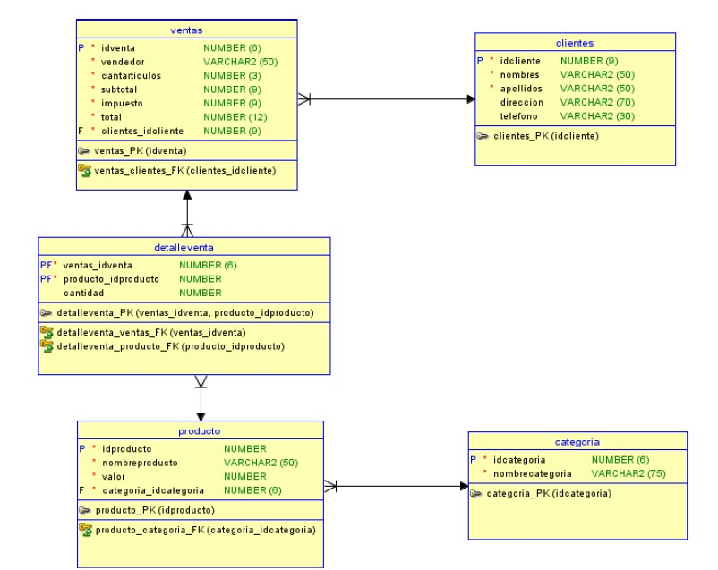

**_<h1 align="center">:vulcan_salute: BBDD Ventas ABP2_AE5:computer:</h1>_**

**<h3>:blue_book: Contexto de la Actividad:</h3>**

<p>Este ejercicio es la continuación del ejercicio individual del presente aprendizaje esperado.</p>
<p>Un negocio minorista desea llevar registro de las ventas diarias realizadas. Hasta hace un tiempo, el modelo de datos que tenían era el siguiente:</p>



**<h3>:orange_book: Requerimiento:</h3>**

<p>A este modelo se desea agregar las siguientes tablas:</p>
<ul>
  <li>Una tabla que permita registrar las facturas generadas. Cada factura se asocia a una venta específica, y cada venta al mismo tiempo puede ser cancelada a través de una o más facturas. De cada factura interesa saber su número único y correlativo, la fecha de generación, la fecha de pago, el monto de la factura, el subtotal, el impuesto y el total.</li>
  <li>Una tabla que permita almacenar órdenes de compra. De cada orden de compra se debe registrar un código único, una fecha de creación, el nombre del trabajador que la autoriza y un campo que permita registrar observaciones. Es necesario destacar que cada venta solo tendrá una orden de compra asociada.</li>
  <li>TUna tabla que permita almacenar las adquisiciones realizadas para cada producto. En esta tabla se debe registrar un número correlativo, la fecha de compra, el nombre del proveedor y la cantidad adquirida.</li>
</ul>
<p>Como parte de este ejercicio se pide realizar un modelo de datos que contenga las tablas del modelo inicial más aquellas que se indican anteriormente.</p>

**<h3>:green_book: Construcción de la Base de Datos Original:</h3>**

<p>ABP2 AE5 – MODELO ENTIDAD RELACIÓN (DDL) - TABLA INICIAL</p>

```SQL
-- ======================================================
-- 1) CATEGORIA
-- ======================================================
CREATE TABLE categoria (
  idcategoria int NOT NULL,
  nombrecategoria varchar(75) NOT NULL,
  PRIMARY KEY (idcategoria)
);

-- ======================================================
-- 2) CLIENTES
-- ======================================================
CREATE TABLE clientes (
  idcliente int NOT NULL,
  nombres varchar(50) NOT NULL,
  apellidos varchar(50) NOT NULL,
  direccion varchar(70) DEFAULT NULL,
  telefono int DEFAULT NULL,
  PRIMARY KEY (idcliente)
);

-- ======================================================
-- 3) DETALLE VENTA
-- ======================================================
CREATE TABLE detalleventa (
  ventas_idventa int NOT NULL,
  producto_idproducto int NOT NULL,
  cantidad int DEFAULT NULL,
  PRIMARY KEY (ventas_idventa, producto_idproducto),
  KEY idx_detalle_venta (ventas_idventa),
  KEY idx_detalle_producto (producto_idproducto),
  CONSTRAINT detalleventa_ibfk_1 FOREIGN KEY (ventas_idventa) REFERENCES ventas (idventa),
  CONSTRAINT detalleventa_ibfk_2 FOREIGN KEY (producto_idproducto) REFERENCES producto (idproducto)
);

-- ======================================================
-- 4) PRODUCTO
-- ======================================================
CREATE TABLE producto (
  idproducto int NOT NULL,
  nombreproducto varchar(50) NOT NULL,
  valor int NOT NULL,
  categoria_idcategoria int NOT NULL,
  PRIMARY KEY (idproducto),
  KEY idx_producto_categoria (categoria_idcategoria),
  CONSTRAINT producto_categoria_fk FOREIGN KEY (categoria_idcategoria) REFERENCES categoria (idcategoria) ON DELETE RESTRICT ON UPDATE CASCADE
);

-- ======================================================
-- 5) VENTAS
-- ======================================================
CREATE TABLE ventas (
  idventa int NOT NULL,
  vendedor varchar(50) DEFAULT NULL,
  cantarticulos int NOT NULL,
  subtotal int NOT NULL,
  impuesto int NOT NULL,
  total int NOT NULL,
  clientes_idcliente int NOT NULL,
  PRIMARY KEY (idventa),
  KEY idx_ventas_cliente (clientes_idcliente),
  CONSTRAINT ventas_ibfk_1 FOREIGN KEY (clientes_idcliente) REFERENCES clientes (idcliente)
);

-- ============================
-- Verificación rápida
-- ============================
SHOW TABLES;
SHOW CREATE TABLE categoria;
SHOW CREATE TABLE clientes;
SHOW CREATE TABLE detalleventa;
SHOW CREATE TABLE producto;
SHOW CREATE TABLE ventas;
```

**<h3>:blue_book: Consultas ejecutadas:</h3>**

<p>Modificando la base de datos migrando incorporando tres tablas:</p>

```SQL
-- ============================================================
-- 1) FACTURA: varias facturas pueden cancelar una misma venta
-- ============================================================
CREATE TABLE factura (
  numfactura INT NOT NULL AUTO_INCREMENT,          -- número único y correlativo
  fecha_generacion DATE NOT NULL,
  fecha_pago DATE DEFAULT NULL,
  monto INT NOT NULL,                              -- monto de la factura (por ejemplo, monto pagado)
  subtotal INT NOT NULL,
  impuesto INT NOT NULL,
  total INT NOT NULL,
  venta_idventa INT NOT NULL,                      -- FK a ventas
  PRIMARY KEY (numfactura),
  KEY idx_factura_venta (venta_idventa),
  CONSTRAINT factura_venta_fk
    FOREIGN KEY (venta_idventa)
    REFERENCES ventas (idventa)
    ON UPDATE CASCADE
    ON DELETE RESTRICT,
  CHECK (subtotal >= 0),
  CHECK (impuesto >= 0),
  CHECK (total = subtotal + impuesto)
) ENGINE=InnoDB DEFAULT CHARSET=utf8mb4 COLLATE=utf8mb4_0900_ai_ci;

-- ==========================================================================
-- 2) ORDEN_COMPRA: relación 1 a 1 con venta (cada venta tiene una sola orden)
-- ==========================================================================
CREATE TABLE orden_compra (
  idorden_compra INT NOT NULL AUTO_INCREMENT,
  fecha_creacion DATE NOT NULL,
  autorizado_por VARCHAR(100) NOT NULL,
  observaciones VARCHAR(255) DEFAULT NULL,
  venta_idventa INT NOT NULL,                      -- FK a ventas (UNIQUE para forzar 1 a 1)
  PRIMARY KEY (idorden_compra),
  UNIQUE KEY uq_orden_compra_venta (venta_idventa),
  CONSTRAINT orden_compra_venta_fk
    FOREIGN KEY (venta_idventa)
    REFERENCES ventas (idventa)
    ON UPDATE CASCADE
    ON DELETE RESTRICT
) ENGINE=InnoDB DEFAULT CHARSET=utf8mb4 COLLATE=utf8mb4_0900_ai_ci;

-- =============================================================================
--   3) ADQUISICION_PRODUCTO: adquisiciones/compras de stock por producto (N a 1)
-- =============================================================================
CREATE TABLE adquisicion_producto (
  idadquisicion INT NOT NULL AUTO_INCREMENT,       -- correlativo
  fecha_compra DATE NOT NULL,
  proveedor VARCHAR(120) NOT NULL,
  cantidad INT NOT NULL,
  producto_idproducto INT NOT NULL,                -- FK a producto
  PRIMARY KEY (idadquisicion),
  KEY idx_adq_producto (producto_idproducto),
  CONSTRAINT adq_producto_fk
    FOREIGN KEY (producto_idproducto)
    REFERENCES producto (idproducto)
    ON UPDATE CASCADE
    ON DELETE RESTRICT,
  CHECK (cantidad > 0)
) ENGINE=InnoDB DEFAULT CHARSET=utf8mb4 COLLATE=utf8mb4_0900_ai_ci;

SHOW TABLES;
SHOW CREATE TABLE factura;
SHOW CREATE TABLE orden_compra;
SHOW CREATE TABLE adquisicion_producto;
```

**<h3>📁 Estructura del Proyecto:</h3>**

```
📁 abp_ae5_clinica_san_patras
├── 📘 README.md
├─── 📁 img
│   └── 🖼️ eer_diagram.jpg
└──  📁 mysql
    └── 🟩 eer_diagram.mwb
    └── 🟩 creando_tablas_M4_ABP_AE5.sql
```

**<h3>:book: EER Diagram Final:</h3>**


